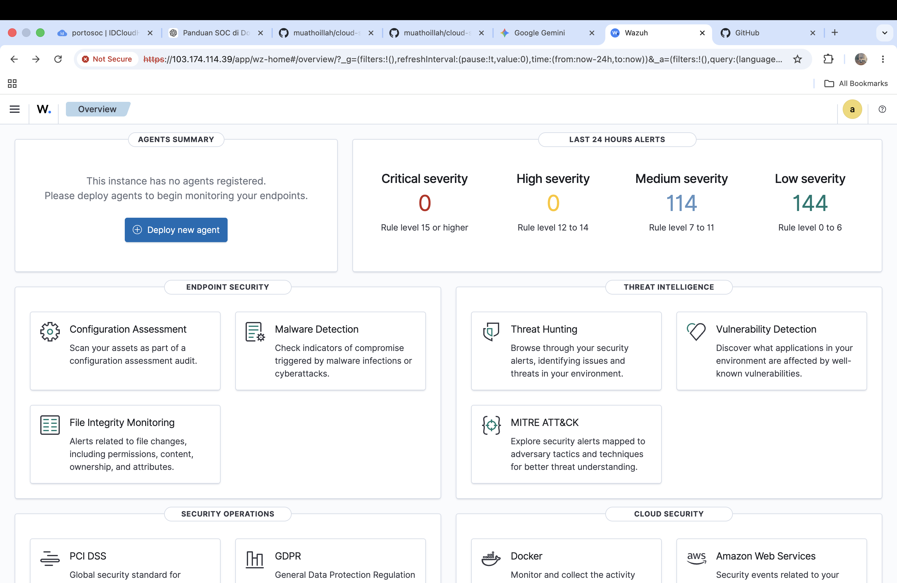
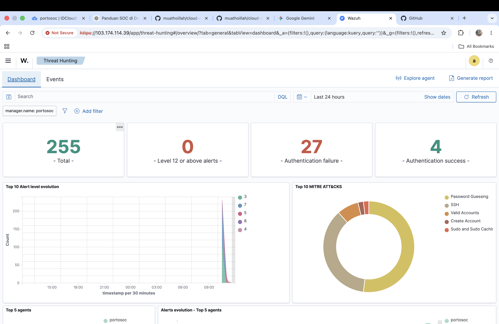
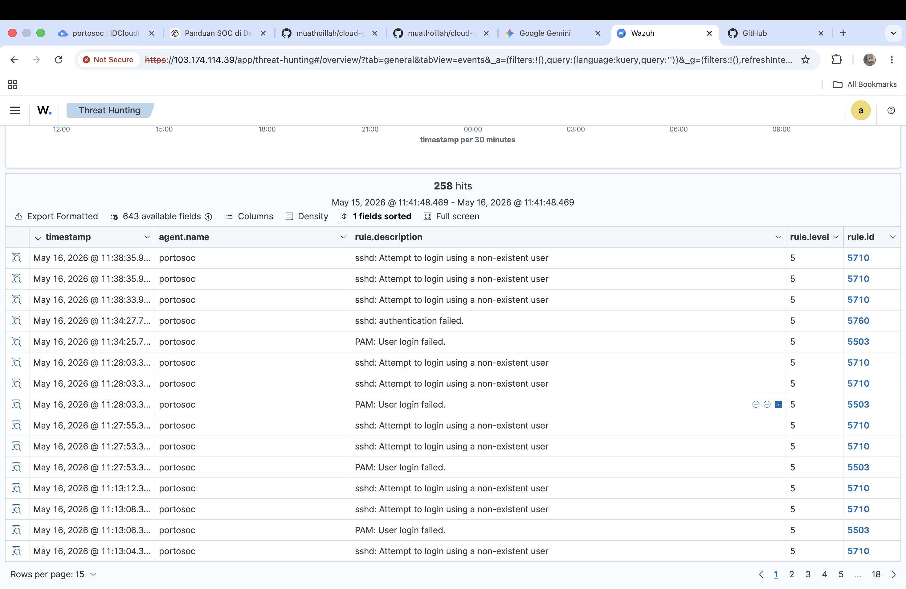
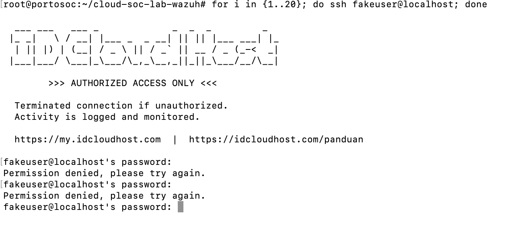

# Cloud SOC Lab with Wazuh

## Overview
This project demonstrates a cloud-hosted SOC (Security Operations Center) lab built using Wazuh SIEM on an Ubuntu VPS.

The lab was designed for:
- Threat monitoring
- Security event analysis
- Endpoint monitoring
- Authentication failure detection
- Threat hunting

---

## Technologies Used
- Wazuh SIEM
- Ubuntu Server
- Docker
- VPS Infrastructure

---

## Features
- Real-time log monitoring
- SSH brute-force detection
- PAM authentication monitoring
- Threat Hunting dashboard
- MITRE ATT&CK mapping
- Security event visualization

---

## Simulated Attacks
### SSH Brute Force Simulation
```bash
for i in {1..20}; do ssh fakeuser@localhost; done
```

### Privilege Escalation Activity
```bash
sudo su
```

---

## Detection Results
Wazuh successfully detected:
- Failed SSH login attempts
- Non-existent user login attempts
- PAM authentication failures
- Privilege escalation activity

---
---
## Screenshots

### Wazuh Dashboard


### Threat Hunting


### Security Alerts


### SSH Brute Force Detection


## Skills Demonstrated
- SIEM deployment
- SOC monitoring workflow
- Threat hunting
- Log analysis
- Linux administration
- Security event investigation
